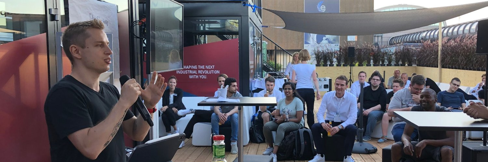

# Hey there! 

I'm Bogdan! I'm the accessibility consultant who helps product owners ship accessible websites without blocking ongoing work.

I have over ten years of experience working in the education and healthcare sectors, with expertise in inclusive design, technology and accessibility on the web.

Imagine you didn't have to worry about:

- ✅ critical accessibility issues in production,
- ✅ cryptic issues in your backlog,
- ✅ how long it takes your team to fix the accessibility issues in it,
- ✅ new accessibility issues a release introduces,
- ✅ costly redesigns and rework, or
- ✅ what all the fancy acronyms mean.

I do this through a monthly subscription that allows us to work together based on the level of support your team needs. I belive this is the most effective way to make progress quickly. By eliminating the friction of changing priorities, debating scope and exchanging proposals, contracts and statements of work, I can help you consistently ship an accessible product.

[Book 1:1 👉 Start shipping](https://bogdanlazar.com/work-with-me)

## Grab a free accessibility resource

- [Accessibility Checklists](https://bogdanlazar.com/resources/accessibility-checklists). A set of free checklists as PDFs for product owners, designers, developers and testers to nudge you towards a more accessible outcome by weaving accessibility into your software development lifecycle.
- [Six Days to an Accessible Website](https://bogdanlazar.com/resources/six-days-to-an-accessible-website). A free six day email course to teach you how to get the upper-hand on 1 million websites by fixing the most common accessibility issues on yours.

Or use one of my open source packages:

<table>
  <thead align="center">
    <tr>
      <td><b>Project</b></td>
      <td><b>Description</b></td>
    </tr>
  </thead>
  <tbody>
    <tr>
      <td width="30%"><a href="https://npm.im/npm.im/a11y-reset">Accessibility CSS Reset</a></td>
      <td>A style reset specifically aimed at accessibility that embraces modern CSS features to help start your project without accessibility errors</td>
    </tr>
    <tr>
      <td width="30%"><a href="https://github.com/tricinel/wcag-search-alfred-workflow">WCAG2.2 Search Alfred Workflow</a></td>
      <td>Alfred workflow to search the Web Content Accessibility Guidelines (WCAG).</td>
    </tr>
    <tr>
      <td width="30%"><a href="https://npm.im/highlight-words">Highlight Words</a></td>
      <td>Split a piece of text into chunks given a search query, by separating matches from non-matches, allowing you to highlight the matches, visually or otherwise, in your app</td>
    </tr>
  </tbody>
</table>

### Languages and Tools

        

#### GitHub Stats

##### How to reach me

