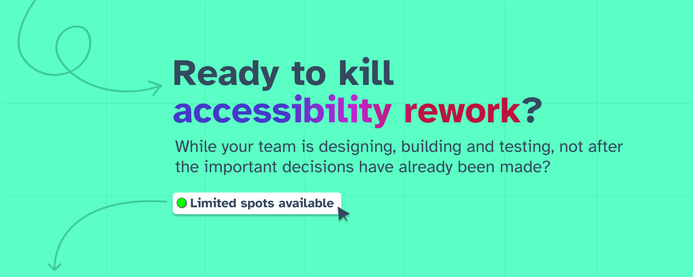

# Hey there! 

I'm Bogdan!

**I help product teams kill accessibility rework before it slows delivery.**

I work with Heads of Product and cross-functional teams at growing digital health organisations where accessibility issues usually don't start as accessibility problems. They show up as:

- defects found late by QA,
- cryptic issues nobody knows how to fix,
- designers and engineers revisiting finished work,
- releases slowed by preventable quality problems,
- unclear ownership across Product, Design, Engineering and QA, or
- debates about what "done" means.

I work alongside your team while real product work is happening.

That can include:

- reviewing designs before implementation,
- helping engineers solve tricky component behaviour,
- creating clearer QA checks,
- making ownership and decisions easier to understand, and
- turning lessons from one feature into better ways of working.

I do this through a monthly subscription, giving your team practical access to accessibility support as priorities change. We can focus on the work that matters most without spending time renegotiating scope, exchanging proposals or writing statements of work.

The goal is to help your team catch issues earlier, make better decisions and ship quality software with less rework.

[Learn more about working together](https://bogdanlazar.com/work-with-me/subscription)

### Ready to kill accessibility rework?

Take **Kill accessibility rework in 5 days**, a free email course for digital health product leaders who want fewer late accessibility surprises, less rework and teams that know what done means.

Or use one of my open source packages:

<table>
  <thead align="center">
    <tr>
      <td><b>Project</b></td>
      <td><b>Description</b></td>
    </tr>
  </thead>
  <tbody>
    <tr>
      <td width="30%"><a href="https://npm.im/a11y-reset">Accessibility CSS Reset</a></td>
      <td>A style reset specifically aimed at accessibility that embraces modern CSS features to help start your project without accessibility errors</td>
    </tr>
    <tr>
      <td width="30%"><a href="https://github.com/tricinel/alfred-wcag-search">WCAG2.2 Search Alfred Workflow</a></td>
      <td>Alfred workflow to search the Web Content Accessibility Guidelines (WCAG).</td>
    </tr>
    <tr>
      <td width="30%"><a href="https://npm.im/highlight-words">Highlight Words</a></td>
      <td>Split a piece of text into chunks given a search query, by separating matches from non-matches, allowing you to highlight the matches, visually or otherwise, in your app</td>
    </tr>
  </tbody>
</table>

#### Languages and Tools

         

##### Get in touch

[![Linkedin Badge](https://img.shields.io/badge/-tricinel-blue?style=flat&logo=&logoColor=white&link=https://www.linkedin.com/in/tricinel/)](https://www.linkedin.com/in/tricinel/)

