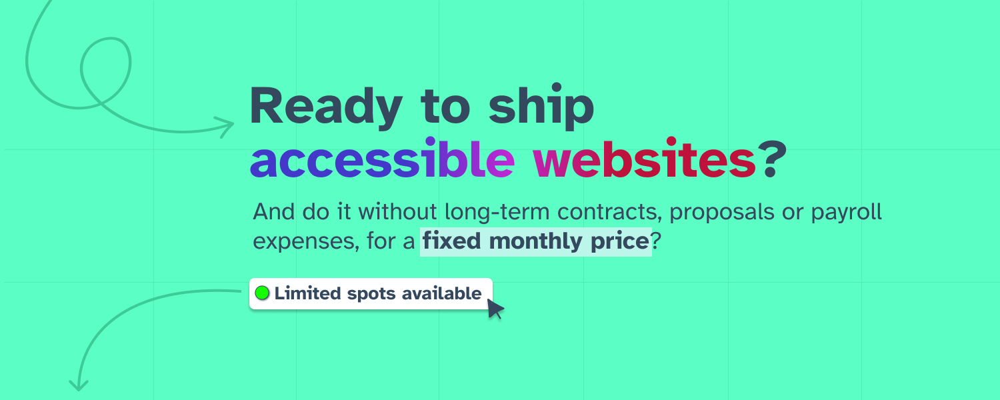

# Hey there! 

I'm Bogdan, a front-end UI developer specialising in modern JavaScript and CSS, progressive enhancement and accessibility on the web. Passionately advocating for design systems as a means to create fast and accessible websites and web apps, and improving the developer experience through better tools and processes.

I currently live in Düsseldorf, Germany, with my nutty dog Scooby.

## Highlights from my npm packages

<table>
  <thead align="center">
    <tr>
      <td><b>Project</b></td>
      <td><b>Description</b></td>
    </tr>
  </thead>
  <tbody>
    <tr>
      <td width="30%"><a href="https://npm.im/cuddy">Cuddy</a></td>
      <td>An aggregation pipeline built in a functional programming style that lets you search, group, order and transform a collection</td>
    </tr>
    <tr>
      <td width="30%"><a href="https://npm.im/highlight-words">Highlight Words</a></td>
      <td>Split a piece of text into chunks given a search query, by separating matches from non-matches, allowing you to highlight the matches, visually or otherwise, in your app</td>
    </tr>
    <tr>
      <td width="30%"><a href="https://npm.im/svelte-timezone-picker">Svelte Timezone Picker</a></td>
      <td>A timezone picker that will allow the user to pick a timezone from a list, fully accessible and follows the ARIA design pattern for a <a href="https://www.w3.org/TR/wai-aria-practices/examples/listbox/listbox-collapsible.html">select</a></td>
    </tr>
  </tbody>
</table>

### Languages and Tools

            

#### GitHub Stats

#### Todoist Stats

<!-- TODO-IST:START -->
<!-- TODO-IST:END -->

##### How to reach me

- Reach me on [Twitter](https://twitter.com/tricinel) or [Linkedin](https://linkedin.com/in/tricinel)
- [Resume]()
